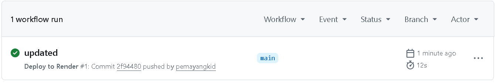
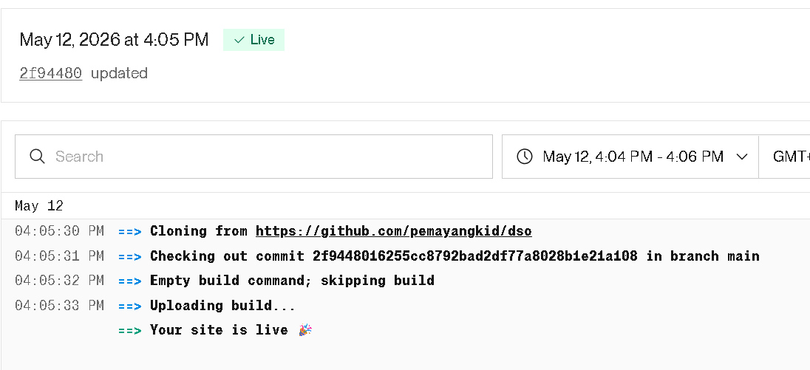

# My First Web App – DSO101 Assignment IV

## Live URL
https://assignment4-1a8w.onrender.com

## Steps Followed
1. Created static HTML + CSS website
2. Pushed code to GitHub
3. Set up GitHub Actions workflow for CI/CD

4. Deployed on Render as a Static Site

## Tools Used
- Git & GitHub
- GitHub Actions
- Render

## Git repo
https://github.com/pemayangkid/dso.git